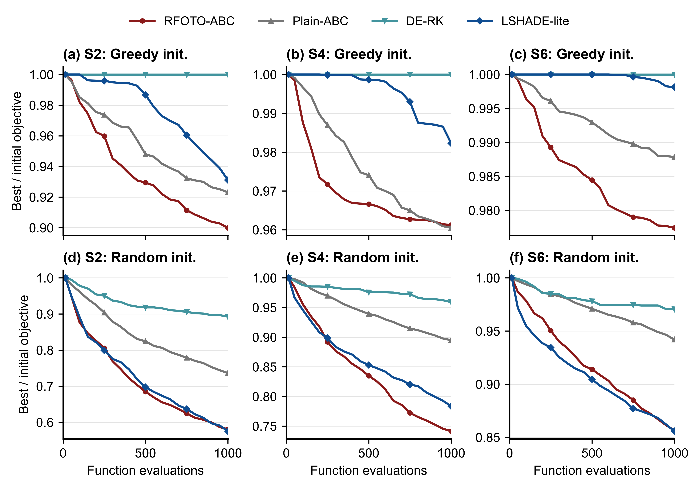
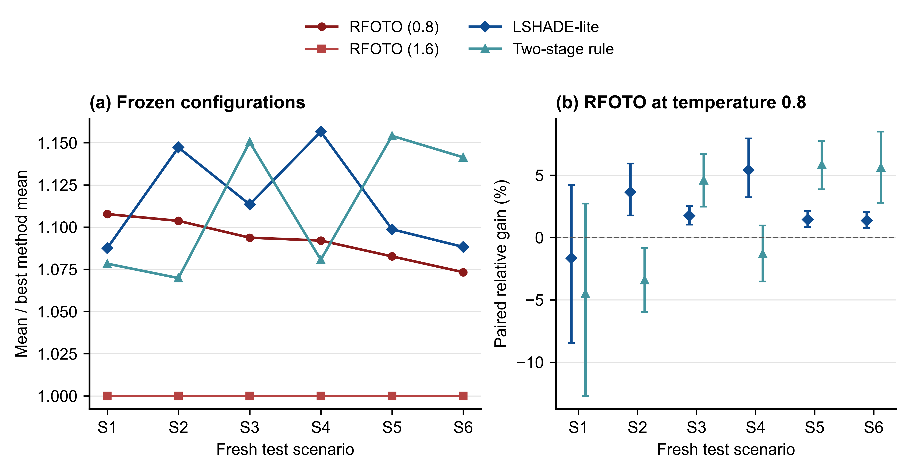

# RFOTO-ABC

Research code and recorded data for reliability- and fairness-aware mobile edge task offloading and resource allocation using artificial bee colony optimization.

This release follows the **9 September 2026 comprehensive Chinese manuscript revision**. Authors: **YongLu, Yaohuizhong, Yunfei Liu**, Minzu University of China. Correspondence: YongLu, 2006153@muc.edu.cn. The manuscript is in preparation; acceptance or publication in Telecommunication Systems is not claimed.

## Four core experiments

| Paper section | Entry point | Evidence |
|---|---|---|
| 4.3.1 Overall performance and finite-budget search | [01_comparison.py](experiments/01_comparison.py) | Historical 11-method comparisons and matched initialization at 320/1000 evaluations |
| 4.3.2 Components and allocation boundaries | [02_ablation.py](experiments/02_ablation.py) | Historical common-weight rescoring and fixed-objective interventions |
| 4.3.3 Parameter sensitivity and stability | [03_sensitivity.py](experiments/03_sensitivity.py) | Historical sweep and prespecified temperature 0.8 versus 1.6 test |
| 4.3.4 Cross-scenario applicability and scale | [04_generalization.py](experiments/04_generalization.py) | Six fresh scenario groups, observed-state stress, scale and dynamic limitations |

Overlapping comparisons reuse the same records, not additional independent experiments. All historical raw evidence, including null and reversed results, remains in `datas/raw_results/`. The **2,040 revision records and 180 instances** are in `datas/revision_20260909/`.

## Main findings and boundaries

- The historical advanced comparison has **45 unique best, 2 tied best and 1 non-best** RFOTO-ABC outcomes across 48 paired instances. Current tables replace the obsolete tie-breaking count.
- Matched greedy initialization supports additional search improvement against LSHADE-lite in some budget/scenario strata. Random initialization does not establish a universal advantage.
- Fixed-objective ablations do not demonstrate independent benefits for every guidance operation after multiple-comparison correction. Uniform allocation remains an important competing design.
- Prespecified temperature 1.6 improves the mean objective over 0.8 in all six fresh test groups. Other optimizers were not tested at 1.6, so this is not a decoder-controlled optimizer ranking.
- Alibaba data-center workload profiles are combined with simulated wireless channels. Fresh generator states are not an external real-world MEC dataset. Warm-start superiority is not established.





## Quick start

Python 3.12 is recommended. Install dependencies in a virtual environment:

```bash
python -m pip install -r requirements.txt
```

Download the external dataset package first and place it in a `datasets/` directory next to this repository (for this workspace: `C:\RFOTO-ABC\datasets`). See [the dataset setup guide](datasets/DATASET.md). Then run:

```bash
python tools/validate_release.py
python experiments/01_comparison.py
python experiments/02_ablation.py
python experiments/03_sensitivity.py
python experiments/04_generalization.py
```

Default commands summarize archived evidence. For fresh computation on the archived inputs:

```bash
python experiments/01_comparison.py --rerun --max-jobs 4
python tools/core_runner.py --group all --rerun
```

Outputs go to ignored `outputs/`, without replacing recorded evidence. See [REPRODUCIBILITY.md](REPRODUCIBILITY.md).

## Package structure

```text
algorithm/       Model, resource decoder and comparison optimizers
experiments/     Four core entry points and immutable revision backend
datasets/        Dataset download, layout and usage guide only
datas/           Historical data, revision instances/records, current CSV/Excel
images/png/      Ten manuscript figures, English labels, 600 dpi
images/pdf/      Matching vector PDF figures
tools/           Validation, replay, preprocessing and reporting utilities
docs/            Paper-to-artifact mapping and reporting boundaries
```

Current Excel files use white backgrounds and black text. They export recorded results and documented analyses; CSV/JSON remain the authoritative machine-readable evidence. [The figure index](images/README.md) identifies source data. Dataset files are distributed separately through the link and layout documented in [the dataset setup guide](datasets/DATASET.md); the Git repository intentionally tracks only that guide under `datasets/`.

## Citation, licensing and assistance

See [CITATION.cff](CITATION.cff). MIT covers project code; third-party data retain their original terms, described in [THIRD_PARTY_NOTICES.md](THIRD_PARTY_NOTICES.md).

OpenAI Codex assisted with parts of the code, statistical reporting, scientific figures and manuscript preparation. Experimental values were produced by executed programs, with raw records retained. This assistance does not replace author verification or responsibility. Internal drafting logs, caches, display-only mockups and temporary authoring files are excluded from this release.
