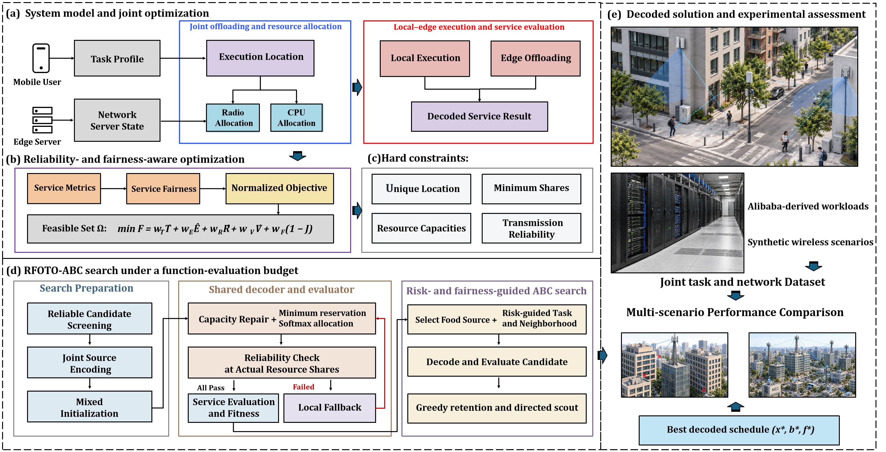
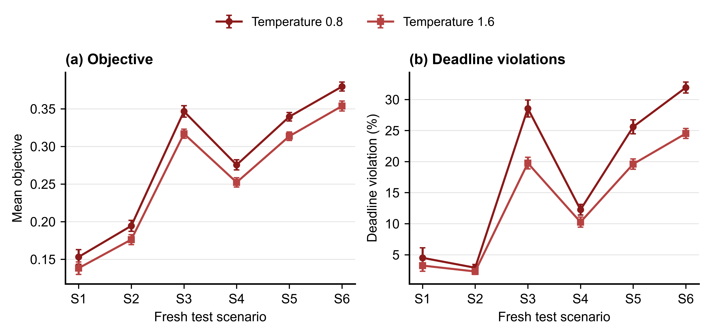

# RFOTO-ABC

Reliability- and fairness-aware task offloading and resource allocation for wireless edge computing.

This repository contains the implementation, recorded experimental evidence, manuscript data tables, and publication figures for the English LaTeX manuscript revised on **10 September 2026**. The manuscript is in preparation; acceptance or publication by *Telecommunication Systems* is not claimed.



## What the study evaluates

RFOTO-ABC jointly selects execution locations, bandwidth shares, and CPU shares. The model combines finite-retransmission reliability, deadline penalties, terminal energy, and service-utility fairness. The optimizer uses feasible construction, capacity-preserving decoding, reliability-based fallback, and finite-budget artificial bee colony search.

| Main finding | Evidence | Boundary |
|---|---|---|
| RFOTO-ABC has the lowest mean objective in four of six main scenarios | 30 runs per scenario in Table 5 and Figure 3 | Two-stage allocation is lower in S2 and S4 |
| Search improves strong identical initial populations | 20 paired instances in S2, S4, and S6; 320 and 1,000 FEs | The advantage is not universal under fully random initialization |
| Resource-share concentration materially affects the objective | Equal-share intervention and temperature sensitivity | Allocation changes multiple objective components and is not an isolated optimizer effect |
| Prespecified temperature 1.6 reduces the paired objective by 6.89–9.38% | Six independent test groups; 20 paired instances per group | Other optimizers were not tested at temperature 1.6 |
| Warm starts do not show stable benefit in the recorded rolling test | Three independent 50-slot episodes | The dynamic test is small and uses simulated channels |

## Repository structure

```text
algorithm/       RFOTO-ABC, comparison optimizers, decoder, and model
experiments/     Four public experiment entry points and revision backend
datas/           Recorded results, frozen instances, analyses, and Tables 5–15
datasets/        External dataset download and setup guide only
images/pdf/      Fourteen exact vector figures used by the English manuscript
images/png/      Matching GitHub previews
tools/           Validation, replay, table export, and figure regeneration
docs/            Manuscript-to-repository alignment and reporting boundaries
```

Large dataset payloads are intentionally stored outside Git. Download them from the location in [DATASET.md](datasets/DATASET.md) and place the `datasets/` directory next to this repository. In the author's workspace, the relationship is:

```text
C:\RFOTO-ABC\
├── git-content\   # this repository
└── datasets\      # external data package
```

Set `RFOTO_DATASETS_DIR` only when the external data is stored elsewhere.

## Quick start

Python 3.12 is recommended.

```bash
python -m pip install -r requirements.txt
python tools/validate_release.py
python experiments/01_comparison.py
python experiments/02_ablation.py
python experiments/03_sensitivity.py
python experiments/04_generalization.py
```

The default experiment commands summarize archived evidence. Fresh replay writes to ignored `outputs/` paths and does not overwrite recorded results:

```bash
python experiments/01_comparison.py --rerun --max-jobs 4
python tools/core_runner.py --group all --rerun
```

See [REPRODUCIBILITY.md](REPRODUCIBILITY.md) for protocols, budgets, statistics, and integrity checks.

## Figures and manuscript data

The current English manuscript uses one framework figure and thirteen experimental figures. The exact PDFs and matching PNG previews are indexed in [images/README.md](images/README.md). Figure 3 contains the updated main-comparison panel scaling requested on 10 September 2026.



Numerical CSV exports for manuscript Tables 5–15 are under [`datas/tables/`](datas/tables/). Tables 1–4 contain literature, notation, scenario, and parameter information and therefore do not duplicate experimental CSV outputs. Every experimental table links back to its recorded source in [the data dictionary](datas/DATA_DICTIONARY.md).

## Reproducibility boundaries

- Alibaba Cluster Trace v2018 supplies workload-derived profiles; wireless channels are simulated rather than measured MEC traces.
- Historical and revision experiments use different sample sizes and evaluation budgets. Overlapping summaries do not create additional independent experiments.
- Several comparison algorithms are documented project adapters, not certified reproductions of their original authors' implementations.
- The retained advanced-comparison Figure 4 panel and Table 6 aggregates require the source-record reconciliation noted in [docs/README.md](docs/README.md).
- Funding, competing interests, and individual author contributions remain author-confirmation items in the manuscript.

## Citation and license

See [CITATION.cff](CITATION.cff) for software citation metadata. Project code is released under the MIT License; third-party datasets, standards, and dependencies retain their own terms as described in [THIRD_PARTY_NOTICES.md](THIRD_PARTY_NOTICES.md).

OpenAI Codex assisted with translation, language editing, code maintenance, and LaTeX preparation. All scientific claims, data, figures, and final approval remain the authors' responsibility.
